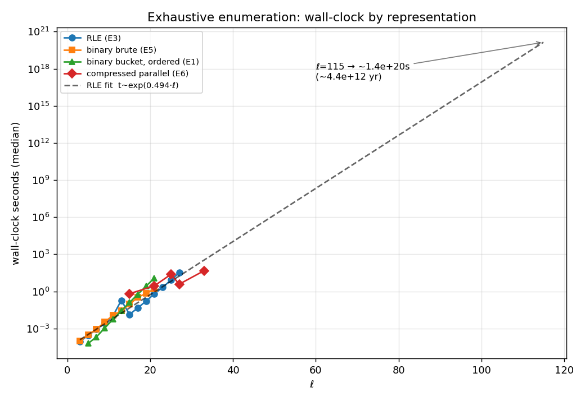
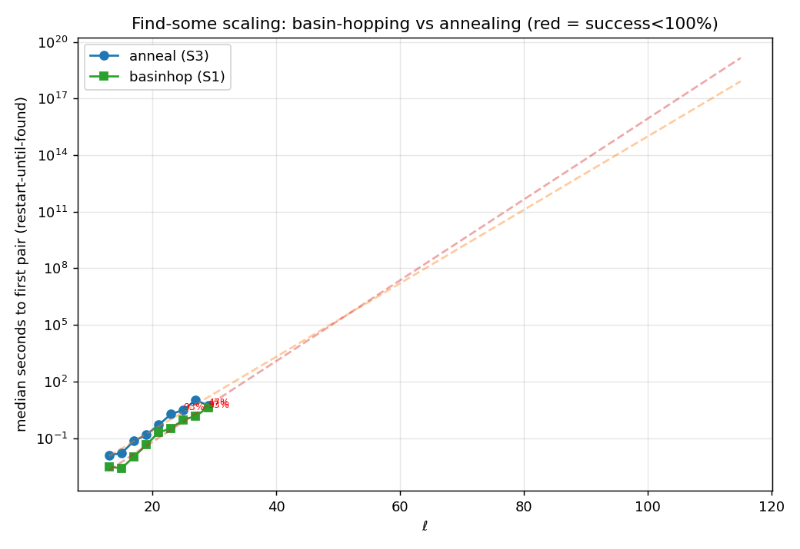
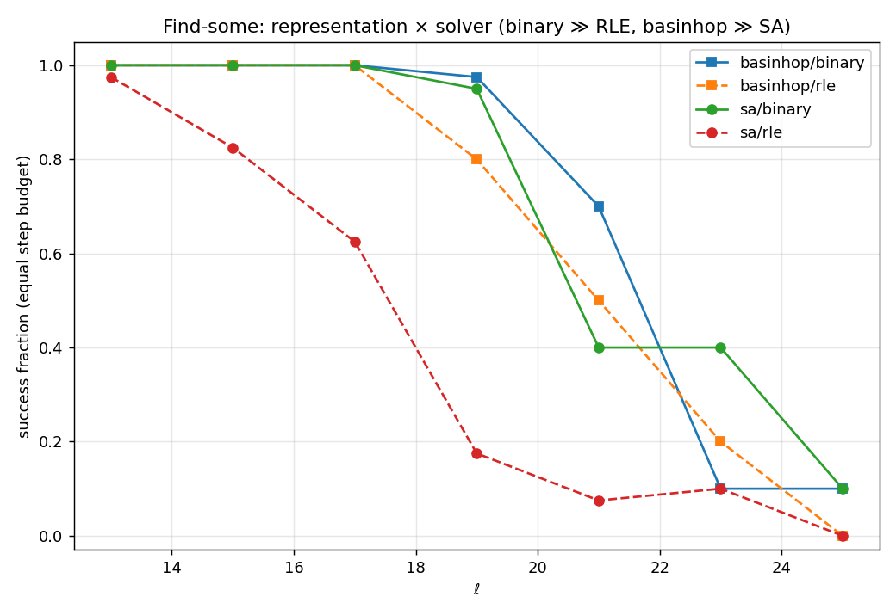

# Legendre-pair search — strategy summary & speed comparison

A single index of every search strategy in this repository, split into the two
families the project explores, with head-to-head timing where the data is
comparable. A **Legendre pair** is $(A,B)\in\{\pm1\}^\ell\times\{\pm1\}^\ell$,
$\ell$ odd, with $\mathrm{PAF}_A(s)+\mathrm{PAF}_B(s)=-2$ for every shift
$s=1,\dots,\tfrac{\ell-1}{2}$; the smallest open order is $\ell=115$.

Two families:

- **Exhaustive / complete** — enumerate the whole (reduced) space; on success
  they *count all* classes and on failure they can *prove* non-existence.
  Cost grows exponentially, so they are the ground truth for small $\ell$.
- **Find-some (stochastic)** — minimize the energy
  $E=\sum_s(\mathrm{PAF}_A(s)+\mathrm{PAF}_B(s)+2)^2\ge0$ (zero iff a pair) by
  local moves + restarts. They find *a* pair fast but prove nothing.

The strategies differ along two axes worth comparing head-to-head:
**representation** (binary $\pm1$ / RLE run-length / compressed-vector) and
**execution** (serial / parallel).

---

## Family 1 — Exhaustive / complete

| ID | Strategy | Representation | Serial/Parallel | Entry point |
|----|----------|----------------|-----------------|-------------|
| **E1** | Normalized enumeration ($\sum=\pm1$) + PAF-bucket meet-in-the-middle | binary $\pm1$ | serial, parallel, incremental early-stop | `src/legendre.py` |
| **E2** | FFT/PSD-filtered enumeration (single-seq PSD prune, then pairwise) | binary + spectrum | serial + `multiprocessing.Pool` | `src/legendre_pairs.py` |
| **E3** | Canonical RLE enumeration (`iter_canonical`→filter→match) | **RLE** | serial | `rle_experiment/lp_rle/exhaust.py` |
| **E4** | RLE enumeration, parallel (task per composition) | RLE | parallel `Pool` | `rle_experiment/lp_rle/parallel.py` |
| **E5** | Plain binary brute force (numba, PSD-bucketed) — correctness anchor | binary | serial (numba) | `rle_experiment/lp_rle/bruteforce.py` |
| **E6** | Compression funnel: sieve $\to$ orbit-reduce $\to$ lift $\to$ PAF-test | **compressed vectors** | serial + parallel | `compression_experiment/` |
| **E7** | Signature-convolution census + good-group ($GG$) orbits | bitmask | serial + `--cores` | `census/census.py` |
| **E8** | CP-SAT complete solver (proves infeasibility; + LNS/hybrid modes) | SAT bits | CP-SAT internal | `src/cp_sat_search.py` |
| **E9** | Endgame exact $k$-swap meet-in-the-middle (barrier width around a plateau) | binary | optional pool | `src/endgame_search.py` |

Key shared reduction (all of E1–E7): every Legendre pair has
$(\sum a)^2+(\sum b)^2=2$, so both row sums are $\pm1$ — work with normalized
($\sum=1$) representatives only.

### Exhaustive wall-clock, by representation

Median seconds to enumerate all classes for length $\ell$. Sources:
binary-brute & RLE from `compression_experiment/results/timing_sweep_time.csv`
(same machine, 3 repeats); RLE large-$\ell$ from
`rle_experiment/results/ttf_scaling.csv`; binary-bucket (all *ordered* pairs)
from `results/benchmark_methods.csv`; compressed from
`compression_experiment/results/parallel_B_timing.csv` (12 workers).

| $\ell$ | binary brute (E5) | RLE (E3) | binary bucket, ordered (E1) | compressed, parallel (E6) |
|-------:|------------------:|---------:|----------------------------:|--------------------------:|
| 13 | 0.026 | 0.027 | 0.027 | — (prime) |
| 15 | 0.092 | 0.083 | 0.128 | 0.65 |
| 17 | 0.340 | 0.332 | 0.589 | — (prime) |
| 19 | 0.681 | 0.656 | 2.70 | — (prime) |
| 21 | 1.60 | 1.41 | 12.20 | 2.84 |
| 23 | — | 2.16 | — | — (prime) |
| 25 | — | 8.28 | — | 24.1 |
| 27 | — | 32.2 | — | 17.97 |
| 33 | — | — | — | 665 / **47** best |

Reading it:

- **RLE (E3) and binary brute (E5) are neck-and-neck** and both beat the
  ordered-pair bucket (E1), which pays for materializing every ordered pair.
- **Compression (E6) loses on wall-clock at small $\ell$** — the sieve/orbit/lift
  overhead dominates — but it is the only route that scales in *space*: it reaches
  $\ell=33$ (287 classes) where the flat enumerations run out of memory/time. Its
  win is asymptotic compression $\sim(n+1)^{2m}/2^{2\ell}$, not constant-factor speed.
- Compression only applies to **composite** $\ell$ ($\ell=m\cdot n$); primes
  (13,17,19,23,29,31) have no route B.
- All routes agree on class counts (validated: `matches_db = yes` for every case).



*Exponential fit to the RLE ladder extrapolates $\ell=115$ to $\sim10^{20}$ s
($\sim10^{12}$ yr) — flat enumeration is hopeless regardless of representation.*

### Endgame barrier (E9) — why exhaustive local repair stalls

`results/endgame_*.log`: starting from a stuck plateau ($E=32$) and enumerating
all configs within $k$ swaps, the distance to a true pair exceeds the reachable
$k$ almost always — $\ell=31$: 0/40 cracked within 3 swaps; $\ell=41$: 3/20
within 3; $\ell=33$: 0 within 4 swaps ($10^7$ configs, 150 s). The escape barrier
is genuinely wide, which is exactly why pure descent fails (see Family 2).

---

## Family 2 — Find-some (stochastic / optimization)

| ID | Strategy | Representation | Serial/Parallel | Entry point |
|----|----------|----------------|-----------------|-------------|
| **S1** | Local search: greedy / sideways / anneal / basinhop / threshold | binary | serial | `src/local_search.py` |
| **S2** | Parallel restarts of S1 (first $E=0$ wins, terminate rest) | binary | parallel `Pool` | `src/parallel_search.py` |
| **S3** | Simulated annealing (Metropolis, geometric cooling) | binary | serial | `src/anneal_search.py` |
| **S4** | $(r,n)$ batched kick+gate search (GPU-friendly layout) | binary (batched) | vectorized | `src/rn_search.py` |
| **S5** | Joint SA / basin-hopping / two-stage, swappable move set | **RLE and binary** | serial | `rle_experiment/lp_rle/walk.py` |
| **S6** | Fiber-restricted SA on the compressed space | compressed | serial | `compression_experiment/run_fiber.py` |
| **S7** | Continuous gradient descent on the relaxed quartic — **fails** | real vector | serial | `experiments/continuous_descent.py` |

Landscape facts driving these (from `experiments/analyze_landscape.py`,
`measure_flip_scaling.py`): local minima are **quantized** at $E=32,64$ with long
plateaus; steepest descent reaches $E=0$ only ~2% of the time; one flip changes
$E$ by $O(\ell)$ (not $O(\sqrt\ell)$). Bottleneck is *plateau escape*, not
descent — so restarts / annealing / basin-hopping win and continuous relaxation
(S7) finds 0 pairs (non-binary critical points survive rounding).

### Method comparison at fixed length (binary, `results/benchmark_methods.csv`)

Success rate over 12 trials / median solve seconds. Exhaustive scan shown for
scale.

| $\ell$ | exhaustive scan | greedy | sideways | anneal | threshold | basinhop |
|-------:|----------------:|-------:|---------:|-------:|----------:|---------:|
| 17 | 0.589 | 0.92✗ | 0.025 | 0.013 | 0.043 | 0.030 |
| 19 | 2.70  | 0.50✗ | 0.176 | 0.273 | 0.159 | 0.133 |
| 21 | 12.20 | 0.67✗ | 0.704 | 0.415 | 0.398 | **0.343** |

(✗ = success rate < 1; greedy alone stalls. All others 100% up to $\ell=21$,
and every stochastic method is $30\text{–}40\times$ faster than the exhaustive scan at $\ell=21$.)

### Scaling of "restart until first pair" (binary, median seconds)

`results/scaling_time.csv` (anneal, S3) vs `results/scaling_basinhop.csv`
(basinhop, S1) — 15 trials, 30 s cap.

| $\ell$ | anneal (S3) | basinhop (S1) |
|-------:|------------:|--------------:|
| 21 | 0.497 | 0.198 |
| 23 | 1.85 | 0.329 |
| 25 | 3.14 (93%) | 0.948 |
| 27 | 10.27 | 1.47 |
| 29 | 5.40 (**47%**) | 4.25 (93%) |

**Basin-hopping is the clear winner** — $3\text{–}7\times$ faster than annealing
and far more reliable past $\ell=27$, where annealing's success rate collapses.



*Both scale exponentially ($t\sim e^{0.45\ell}$–$e^{0.49\ell}$), extrapolating to
$\sim10^{18}$–$10^{19}$ s at $\ell=115$ — a huge constant-factor win over
enumeration but the same exponential wall. The extrapolation is optimistic:
success drops below 100% at the tail (red labels), so true cost climbs faster.*

### Representation comparison, equal step budget (`head_to_head_solvers.csv`)

SA vs basin-hopping $\times$ RLE vs binary, success fraction (recovered class
fraction in parentheses). Rows $\ell\le21$: 40 seeds; $\ell=23,25$: 10 seeds
(this session, `head_to_head_solvers_ext.csv`).

| $\ell$ | sa/binary | sa/rle | basinhop/binary | basinhop/rle |
|-------:|----------:|-------:|----------------:|-------------:|
| 13 | 1.00 | 0.98 | 1.00 | 1.00 |
| 15 | 1.00 | 0.83 | 1.00 | 1.00 |
| 17 | 1.00 | 0.63 | 1.00 | 1.00 |
| 19 | 0.95 | 0.18 | 0.98 | 0.80 |
| 21 | 0.40 | 0.08 | 0.70 | 0.50 |
| 23 | 0.40 | 0.10 | 0.10 | 0.20 |
| 25 | 0.10 | 0.00 | 0.10 | 0.00 |

(At $\ell\ge23$ the fixed 20k-step budget saturates all four configs near the
floor — this is where the *restart-until-found* harness above, not a fixed
budget, is the right tool. $\ell=23,25$ rows are 10 seeds, so treat as
indicative.)

Consistent finding across lengths: **binary $\gg$ RLE** for both solvers, and
**basin-hopping $\gg$ SA** — the RLE move set spends effort on macro-moves that
don't pay off under a fixed step budget. Energy regularization
(`ab_energy_reg.csv`) gives no consistent lift.



---

## How to reproduce every number

```bash
# --- Exhaustive ---
python3 src/legendre.py 21 -a -j4 -P                 # E1 binary bucket (all pairs)
python3 -m lp_rle.exhaust 3 5 ... 25                 # E3 RLE (from rle_experiment/)
python3 -m lp_rle.parallel 25 --workers 8 --write    # E4 RLE parallel
python3 -m lp_compress.run_parallel 25:5 27:9 33:11  # E6 compression funnel
python3 census/census.py --step 2 --lmax 19 --orbits # E7 census + GG orbits
python3 src/cp_sat_search.py 21                       # E8 CP-SAT complete
python3 src/endgame_search.py 31 --max-swaps 3        # E9 endgame barrier

# --- Find-some ---
python3 src/local_search.py 21 -s basinhop            # S1
python3 src/parallel_search.py 25 -s basinhop -j4 -P  # S2
python3 src/anneal_search.py 25                        # S3
python3 src/rn_search.py search 21 -r 4096 -n 8        # S4
python3 -m lp_rle.search --solver basinhop --rep binary --L 23  # S5

# --- Benchmarks that regenerate the tables above ---
python3 experiments/benchmark_methods.py --max 21     # method comparison
python3 rle_experiment/ttf_scaling.py                 # exhaust vs SA vs basinhop ladder
python3 -m lp_rle.bench --solvers --Ls 13 15 17 19 21 23 25   # rep comparison
python3 -m lp_compress.timing                          # exhaustive rep wall-clock
```

## Data gaps still open

- Find-some solvers have **no** benchmark past $\ell=25$ (exhaustive RLE reaches
  27, compression reaches 33). Extending S1/S3 to $\ell=29,31$ would need the
  restart-until-found harness, not the fixed-budget one.
- E6 compression has no $\ell=35$ run yet (`Legendre_database` has the pair list).
- Two-stage search (S5) is only in the joint/two-stage grid, never profiled
  against the solver grid.
